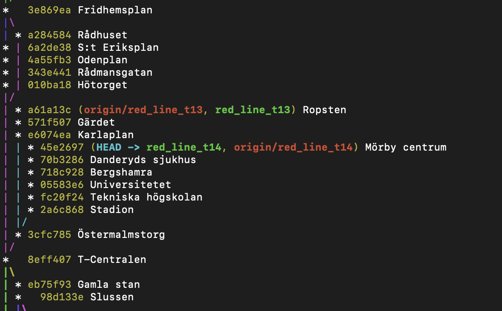

# Stockholm Subway Map As a Git Tree

This Git repository contains the Stockholm subway map as a Git tree where each commit represents a subway station, and a merge commit represents a connection between two or more subway lines.

Use your favourite GUI Git client or run `git log --all --oneline --graph` for a representation like this one: 


You can also view the git tree directly in Github in the [Network view](https://github.com/miksto/stockholm-subway-map-git/network)


## Shell script usage
To rebuild the git tree run:
```
./build-git-tree-sh
```
Runing this script will remove all git branches except the main branch, and then build the subway map git tree from scratch.